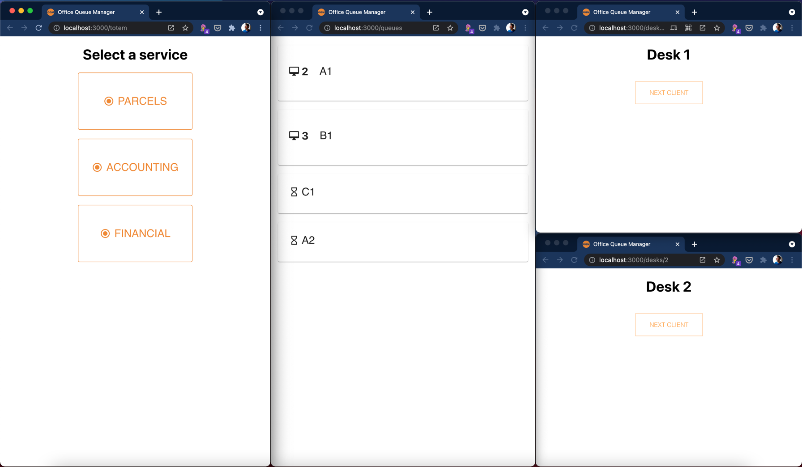

# OQM-p11

Office Queue Management system



## Prerequisites

In order to run this project you'll need a recent version of Node and npm (preferably node@^14 and npm@^7).

## Project structure

This project is structured as an npm workspaces monorepo. The two main packages are `frontend/` and `backend/`.
Find more package-specific information in the child READMEs.

In order to run a subpackage script either do it from the subfolder or using the `-w` flag:

```shell
npm run -w frontend start # From root

cd frontend # Fron the frontend/ folder
npm run start
```

## Available scripts

- `start`: starts the frontend and the backend development servers in parallel.

## Contributing guidelines

- The use of [Conventional Commits](https://www.conventionalcommits.org/) is enforced through git hooks.
- [git flow](https://www.atlassian.com/git/tutorials/comparing-workflows/gitflow-workflow) is appreciated.
